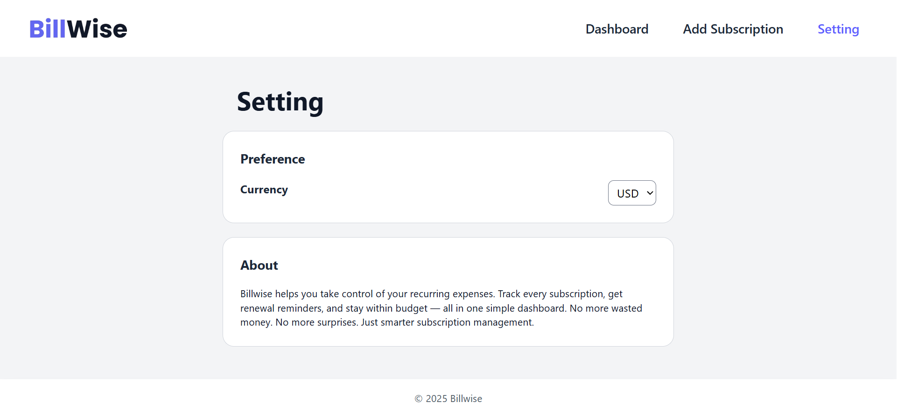
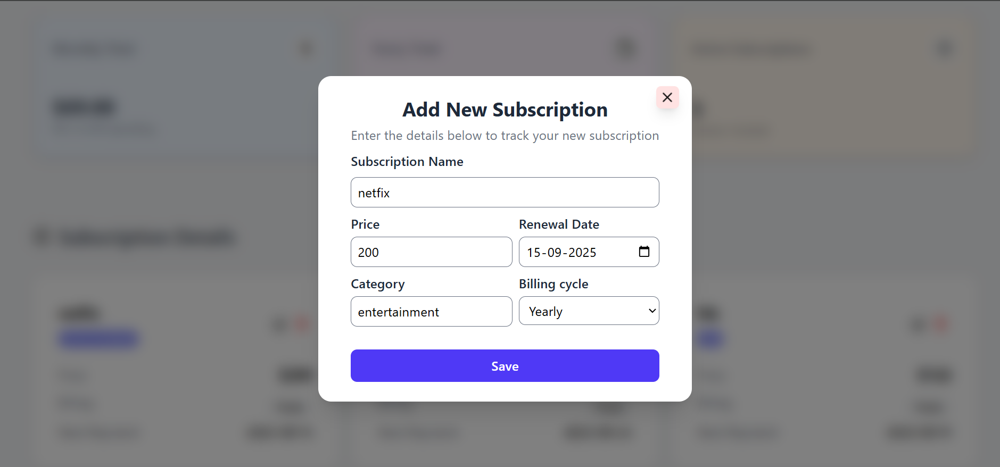

# BillWise 💳  

**BillWise** is a simple and clean **subscription manager app** that helps you track all your recurring expenses in one place.  

With BillWise, you can:  
- ✅ Add, edit, and delete subscriptions  
- 📅 Track billing cycles (monthly/yearly)  
- 💰 See total monthly & yearly spending  
- 📌 Keep data safe in your browser (localStorage)  

---

## 🔧 Tech Stack  
- React (Vite) ⚛️  
- Tailwind CSS 🎨 
- LocalStorage for persistence 💾  

---

## 📸 Screenshots (Coming Soon)  

- **Dashbord** : See all your subscriptions

- **Add Subscription** : Add your new subscription

- **Setting page** : Change the currency from the setting page

- **Edit subscription** : Here you can edit your subscription

 

