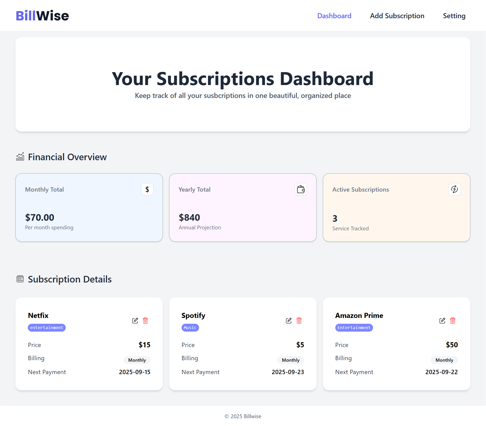

# BillWise – Subscription Tracker App

BillWise is a simple and responsive subscription tracker built using React and Tailwind CSS.  
It helps users manage their monthly/annual subscriptions and keep track of recurring expenses.

## 🚀 Features
- Add, edit, and delete subscriptions
- Track monthly and yearly costs
- LocalStorage persistence (data stays after refresh)
- Clean and responsive UI
- Reusable and modular React components

## 🛠️ Tech Stack
- React
- Tailwind CSS
- LocalStorage
- Vite 

## 📸 Screenshots 

- **Dashbord** : See all your subscriptions




- **Add Subscription** : Add your new subscription


- **Setting page** : Change the currency from the setting page


- **Edit subscription** : Here you can edit your subscription

 


## Live link 🔗

https://bill-wise1.vercel.app/

## 📂 GitHub Repository
https://github.com/itsgauravkumar07/BillWise

## 📦 Setup & Installation

```bash
git clone https://github.com/itsgauravkumar07/BillWise.git  
cd BillWise  
npm install  
npm run dev
